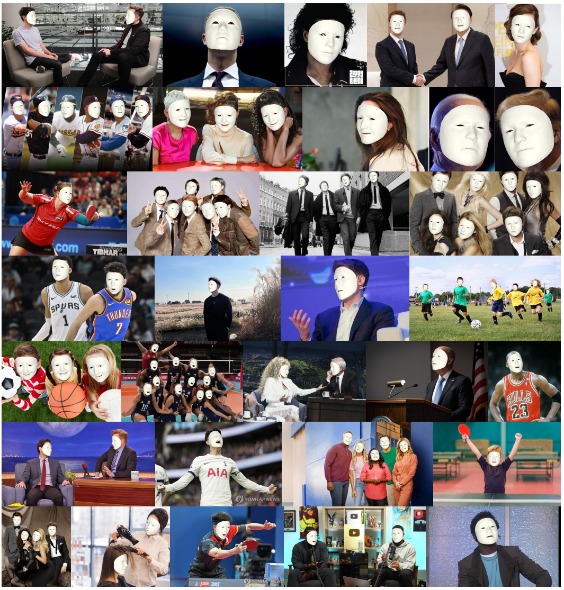
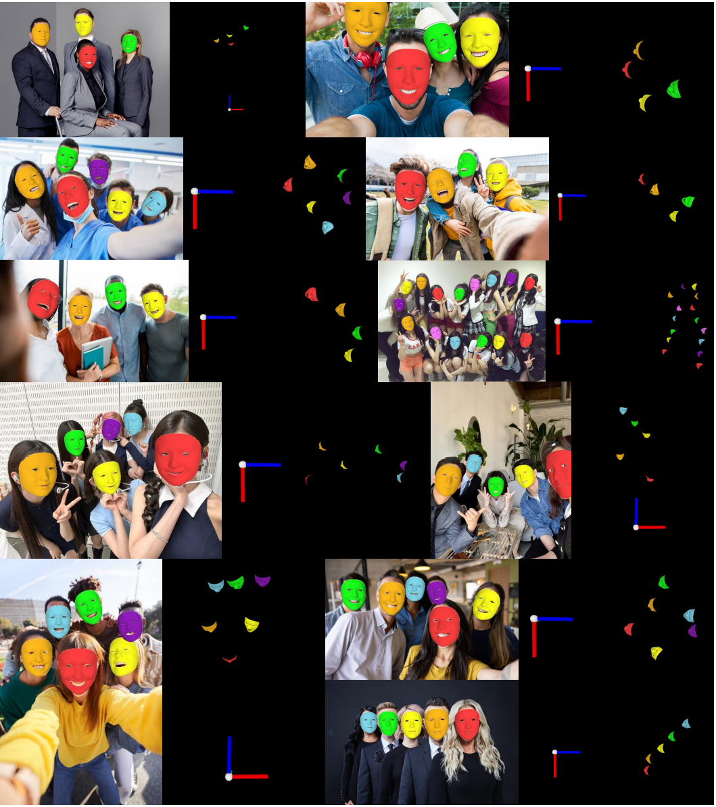
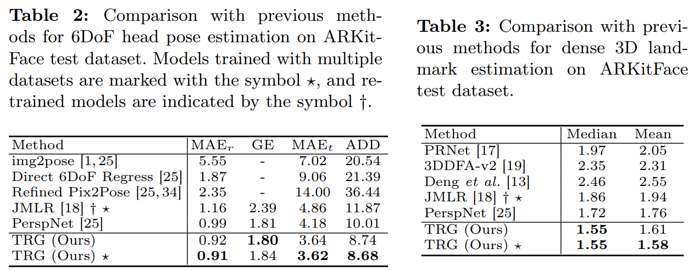
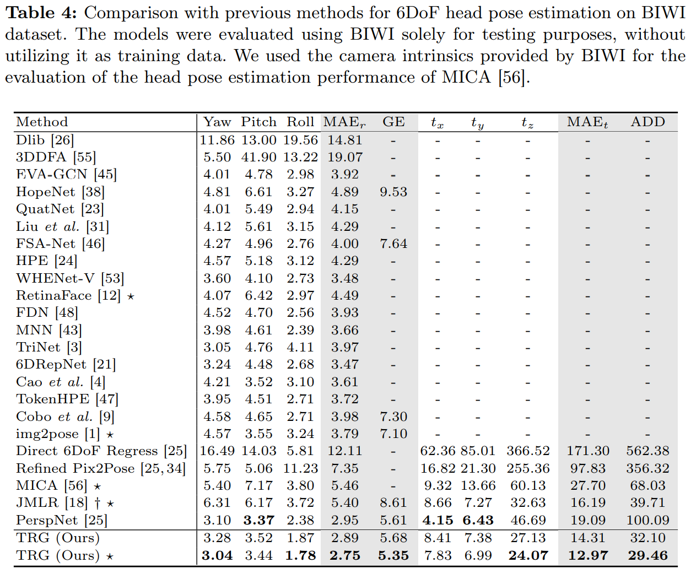
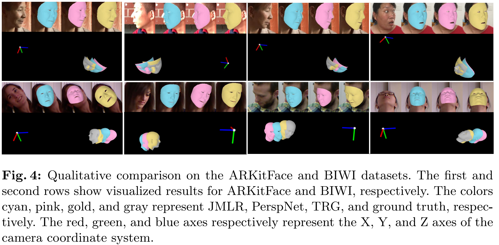

# [ECCV'24] TRG (Translation, Rotation, and face Geometry network)
- This is the official PyTorch implementation of 6DoF Head Pose Estimation through Explicit Bidirectional Interaction with Face Geometry (ECCV 2024)

- We propose a novel 6DoF head pose estimator, **TRG**, which features an explicit bidirectional interaction structure between the 6DoF head pose and face geometry.

- 💪 TRG achieves state-of-the-art performance on the ARKitFace dataset and the BIWI dataset.

## Overview
This study addresses the nuanced challenge of estimating head translations within the context of six-degrees-of-freedom (6DoF) head pose estimation, placing emphasis on this aspect over the more commonly studied head rotations. Identifying a gap in existing methodologies, we recognized the underutilized potential synergy between facial geometry and head translation. To bridge this gap, we propose a novel approach called the head Translation, Rotation, and face Geometry network (TRG), which stands out for its explicit bidirectional interaction structure. This structure has been carefully designed to leverage the complementary relationship between face geometry and head translation, marking a significant advancement in the field of head pose estimation. Our contributions also include the development of a strategy for estimating bounding box correction parameters and a technique for aligning landmarks to image. Both of these innovations demonstrate superior performance in 6DoF head pose estimation tasks. Extensive experiments conducted on ARKitFace and BIWI datasets confirm that the proposed method outperforms current state-of-the-art techniques.

## Installation
Coming soon !

## Results
This repository provides several experimental results:

## Acknowledgement
This work was partly supported by Institute of Information & Communications
Technology Planning & Evaluation (IITP) grant funded by the Korea government (MSIT) (No. RS-2023-00219700, Development of FACS-compatible Facial
Expression Style Transfer Technology for Digital Human, 90%) and National
Research Foundation of Korea (NRF) grant funded by the Korea government
(MSIT) (No. NRF-2022R1F1A1066170, Physically valid 3D human motion reconstruction from multi-view videos, 10%).

## Citation
Coming soon !